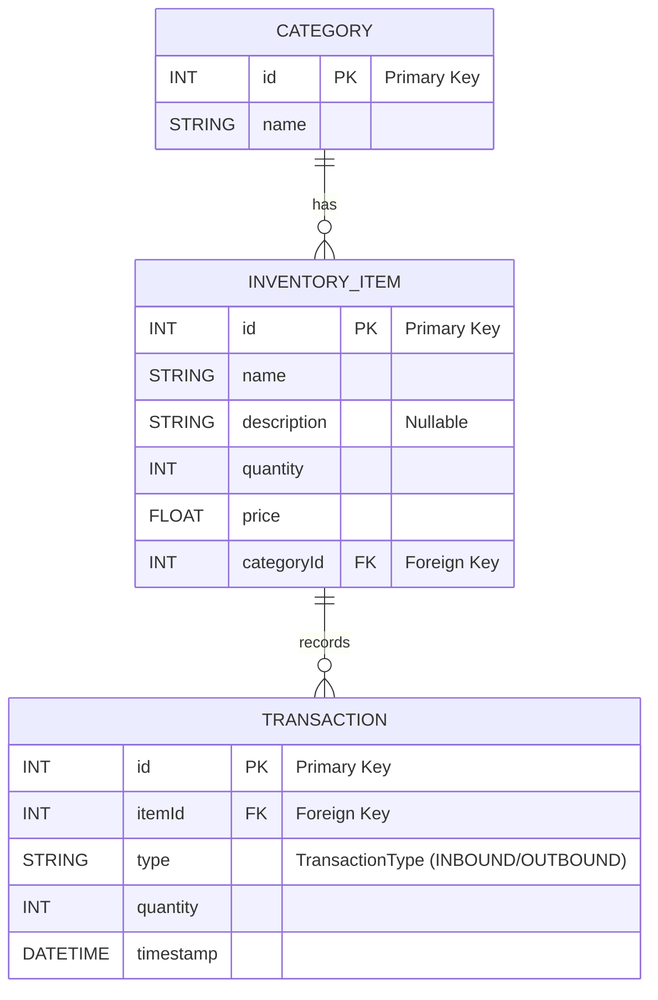

```
mv .env.develop .env
npm i
pnpm push:prisma
npm run start:dev
```

# お題

## アプリケーション概要

在庫管理アプリケーション。\
在庫(InventoryItem)、在庫のカテゴリー（CATEGORY）、取引履歴（TRANSACTION）をデータベースで永続化している。



### 各エンティティの説明

それぞれのエンティティは以下の項目を持つ。

- 在庫

| カラム名    | 説明             |
| :---------- | :--------------- |
| id          | ID               |
| name        | 在庫名           |
| description | 在庫に対する説明 |
| quantity    | 在庫数           |
| price       | 単価             |
| categoryId  | カテゴリID       |

- カテゴリ

| カラム名    | 説明           |
| :---------- | :------------- |
| id          | ID             |
| name        | カテゴリ名     |
| description | カテゴリの説明 |

- 取引履歴

| カラム名    | 説明                  |
| :---------- | :-------------------- |
| id          | ID                    |
| itemId      | 在庫Id                |
| description | 在庫に対する説明      |
| quantity    | 取引数量              |
| type        | 取引種別（入庫/出庫） |
| timestamp   | 取引日時              |

## 実装したい要件

アプリケーションは各エンティティの基本的なCRUDを可能にする。\
ただし、それぞれのエンティティには以下の制約が存在する。

- 在庫更新の検証
  - 出庫処理の際、在庫数が足りない場合はエラーを返す
  - 在庫数の増減に伴い、対応する取引履歴を自動で作成

## 課題

1. 簡単なRead操作についてテストの作成
   - カテゴリの取得処理に対するテスト作成
2. 簡単なWrite操作についてテストの作成
   - カテゴリの作成処理に対するテスト作成
3. 複雑なWrite操作についてのテスト作成
   - 出庫処理に対するテスト作成
4. TDD実践
   - 取引履歴から今月の売り上げを取得する
